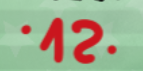
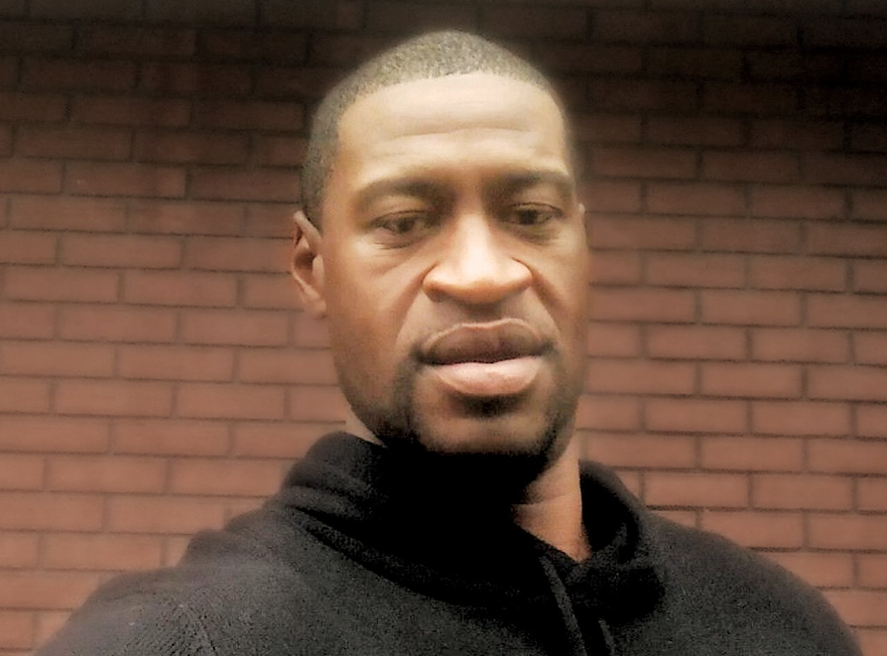

# 0.2 BTC puzzle

## Introduction

On 2020-10-08T09:25:30.484Z (october) a user called [u/stsh_n](https://www.reddit.com/user/stsh_n/) created a [thread in Reddit called "Bitcoin puzzle (2000$)" with only a image](https://www.reddit.com/user/stsh_n/comments/j79zvj/bitcoin_puzzle_2000/). This user left and never come back.

This is the original photo:


*If this info has helped you, please consider donating to [1L7PNjAMaELdhzrp2RLojnAPVk4ksQddMZ](https://www.blockchain.com/explorer/addresses/btc/1L7PNjAMaELdhzrp2RLojnAPVk4ksQddMZ)*

## Contributors

Mainly this information is extracted mainly from reddit threads, so thanks a lot for all your contributions.

Also special thanks to:
- average_student_81 (44 stars/bip44 derivation path and 1713 STOCK).

The idea of this repository is to found or at least give ideas to resolve this puzzle.

## Blockchain

This image is referencing on the bottom left corner a Bitcoin address [1KfZGvwZxsvSmemoCmEV75uqcNzYBHjkHZ](https://blockchair.com/bitcoin/address/1KfZGvwZxsvSmemoCmEV75uqcNzYBHjkHZ) with 0.2 BTC (the price of BTC when author posted the image was around ~10k$). Currently the price is 6,065.00USD.

The author created the following [Bitcoin transaction fcee21d44ee94c09869947c74b61669bf928358e9c2d1699fb075bb6ebf5d043](https://blockchair.com/bitcoin/transaction/fcee21d44ee94c09869947c74b61669bf928358e9c2d1699fb075bb6ebf5d043) on May 10, 2020, 8:01 AMUTC.

In this transaction author uses 4 scripthash addresses and send 0.2 BTC to a pubkeyhash address and the rest to a scripthash address.

## General Hints

Pages with more information:
- [0.2 ₿ puzzle](https://bitcointalk.org/index.php?topic=5404767.0)
- [Private Keys PW](https://privatekeys.pw/puzzles/0.2-btc-puzzle)
- [First Reddit thread](https://www.reddit.com/user/stsh_n/comments/j79zvj/bitcoin_puzzle_2000/)
- [bitcoinpuzzles Reddit thread](https://www.reddit.com/r/bitcoinpuzzles/comments/jrr7mo/is_this_puzzle_still_valid_is_this_image_correct/)
- [cryptopuzzlers Reddit thread](https://www.reddit.com/r/CryptoPuzzlers/comments/mbdogq/02_btc_puzzle/)

## Seed phrase

You will need to guess the:
- Words to use.
- Correct order of the words.
- Correct length.

Date format in the puzzle are:
```
MONTH.DAY.YEAR
05.25.20
11.03.20
```

There are different possible (common) systems to generate a HD root key out of a mnemonic phrase.

### Standardized BIP39

In BIP39 there is a [fixed word list of 2048 words](https://github.com/bitcoin/bips/blob/master/bip-0039/english.txt). There is an english word list and 9 more official lists for other languages.

The length of the seed phrase could be 3 / 6 / 9 / 12 / 15 / 18 / 21 or 24 words.

The last word of eg. a 12 word phrase is not solely a checksum - it contains the last bits of the HD key and a checksum, as every word represents 11 bits (2^11=2048) and 12 words result in 132 bits, of which 128 bits are the key and 4 bits the checksum. A 24 word phrase result in 264 bits (256 bit key and 8 bits checksum).

Also this phrase could be extended with an additional self chosen word/password (not necessary out of the BIP39-wordllist), which completely changes the resulting HD key.

### Old Electrum mnemonic

From [1.9.8 version](https://github.com/spesmilo/electrum/blob/1.9.8/lib/mnemonic.py) and [current version](https://github.com/spesmilo/electrum/blob/master/electrum/old_mnemonic.py) (same files).

This is a list with 1626 words.

```
Note about US patent no 5892470: Here each word does not represent a given digit.
Instead, the digit represented by a word is variable, it depends on the previous word.
```

## Creator

There are two "signs" in the bottom right and in the top corner with "CHaRLy".

Probably [Charly Palmer](https://www.instagram.com/charlylpalmer/?hl=es) could be the author of the image (at least the creator).

[This image](https://www.instagram.com/p/CGED2CMBTzD/) is from the same day that this BTC puzzle was published. "I’m seeing red."

There is other possibility that it could be JR - Jean René.

## Black Lives Matter

[Black Lives Matter (BLM) is a decentralized political](https://en.wikipedia.org/wiki/Black_Lives_Matter) and social movement that seeks to highlight racism, discrimination, and racial inequality experienced by black people. Its primary concerns are incidents of police brutality and racially motivated violence against black people.

#BlackLivesMatter

[How Wikipedia Became a Battleground for Racial Justice JUNE 09, 2020](https://slate.com/technology/2020/06/wikipedia-george-floyd-neutrality.html)

## Image Tools

Here you have a few available tools. 
Foresinc tools:
- [Photo Forensics](https://29a.ch/photo-forensics/#pca)
- [Aperisolve](https://www.aperisolve.com/)
- [Mirror image](https://www.img2go.com/rotate-image/)

There are a lot more over the internet.

## World map


References:

1. Space Needle
2. Statue of Liberty
3. China (M16 location)
4. George Floyd died.
5. The White House

## Wikipedia leaks ?

[A user called "Beaneater00"](https://en.wikipedia.org/w/index.php?title=Special:Contributions/Beaneater00&target=Beaneater00&offset=20201016133238) edited at 05:25 the Wikipedia page "The pot calling the kettle black" the same that this BTC puzzle was published.

There is [other user](https://en.wikipedia.org/wiki/Special:Contributions/188.49.125.254) but probably without relation.

## Table

This table is generated using the following hints. Probably there are wrong words but you can have a starting point from here:

| Order  | Word  | Explanation  |
|---|---|---|
| 1  | subject  | Appear in the section 1 (13th) or it could be 14? |
| 2  | camera  | Two cameras. Maybe could be "twin" word?  |
| 3  | tower  | 1+2 in clock  |
| 4  | mask  | 4 person with a mask  |
| 5  | police  | Line five  |
| 6  |   |   |
| 7  | liberty  | The crown with 7 points that symbolize the 7 seas and 7 continents  |
| 8  |   |   |
| 9  | eye  | 4+5 in the pyramid eye  |
| 10  | black  | Black day number X  |
| 11  | pyramid  | 5+6 inside the pyramid  |
| 12  | vote  | Reverse "versus"  |
| 13  | moon  | 12+1 in clock  |
| 14  |   |   |
| 15  |   |   |
| 16  | rifle  | M16 rifle from China |
| 17  | gold  | Graph shows 17 years of gold price evolution  |
| 18  |   |   |
| 19  | glove  | Appears with vaccine with CVD19 on it |
| 20  | apple  |   |
| 21  |   |   |
| 22  |   |   |
| 23  |   |   |
| 24  |   |   |

## 1. Gold Chart

Puzzle:


References:

This graph has the Y axis that goes from 0 to 1800. It is possible that it is the evolution of the price of the gold/dollar pair. I think it's a dollar because of the stars in the background.

Note: note that gold has reached its maximum price at the time the graph is shown.

Gold price chart

https://www.tradingview.com/chart/?symbol=TVC%3AGOLD

Price at 376.85$
August/2003

Price at 1954.80$
September/2020

17 years from start to end

Monthly chart. It seems a copy and paste from TradingView


Words:
- 803	gold
- 136	axis
- 1100	maximum
- 1364	price
- 1129	minimum

## 2. COVID19

Puzzle:


Hint:

```
COVID 19 IS A
HOAX 5G IS
THE KILLER
```

References:

This is a graffiti that it is fake news about mobile phone (5G) technology found on 2020/apr/26.


Pages:
- [The Guardian](https://www.theguardian.com/world/2020/apr/26/5g-coronavirus-and-contagious-superstition)
- [FT](https://www.ft.com/content/1eeedb71-d9dc-4b13-9b45-fcb7898ae9e1)

As pointed out by average_student_81:

If you look closely at the word COVID you can see 1713 which is STOCK.


Words:
- 1194	news
- 1309	phone
- 1140	mobile
- 1032	liberty

## 3. Donald Trump vs Joe Biden

Puzzle:


References:

Donald Trump represents Red (Republican)

Joe Biden represents Blue (democratic)

Why tie has the inverse color?

[The 2020 United States presidential election](https://en.wikipedia.org/wiki/2020_United_States_presidential_election) was the 59th quadrennial presidential election, held on Tuesday, November 3, 2020.

11.03.20

Trump has a Russian flag on his chest, maybe this is a hint in Russian

If you mirror ".vs.", you will obtain the number "12":



Words:
- 451	debate
- 1968	vote

## 4. Thirteenth Amendment

Puzzle:


Hint:

```
Section 1:
Neither slavery nor
involuntary servitude,
except as a punishment
for crime whereof the
party shall have been
duly convicted, shall exist
within the United States,
or any place subject to
their jurisdiction.
```

Also there is a graffiti with the following text:

```
FUCK
THIS
SHIT
```

References:

[On December 18, 1865, the 13th Amendment](https://constitution.congress.gov/browse/essay/amdt13-S1-1/ALDE_00000992/) was adopted as part of the United States Constitution. The amendment officially abolished slavery, and immediately freed more than 100,000 enslaved people, from Kentucky to Delaware.

These words are underlined:

 * Section *1*
 * or any place *subject* to

## 5. Clock

Puzzle:


References:

Clock hands always point halfway between two numbers on the clock.

Current time is: 10:07

the second pointer between 12 and 1 (12 + 1 = 13) 
the minute pointer between 1 and 2 (1 + 2 = 3)
the hour pointer between 10 and 11 (10 + 11 = 21)

the second pointer has the "moon" word
the minute pointer has the "tower" word

## 6. Esse quam niger es...

Puzzle:


Hint:

```
Esse quam niger es, sic dixit caccabus ollae
```

References:

Russian: Смотри, какой ты черный, - сказал котелок горшку
English: Look how black you are, the bowler hat said to the pot.

"The pot calling the kettle black" is a proverbial idiom that may be of Spanish origin, of which English versions began to appear in the first half of the 17th century.

Wikipedia reference: https://en.wikipedia.org/wiki/The_pot_calling_the_kettle_black

This is the version that the puzzle creator maybe seen of this [Wikipedia article](https://en.wikipedia.org/w/index.php?title=The_pot_calling_the_kettle_black&oldid=977612957) from 9 September 2020.

Probably is related to [Donald Trump vs Joe Biden](#3-donald-trump-vs-joe-biden).

Words:
- 184	black
- 698	fire
- 14	accuse
- 1941	verb (proverb?)

## 7. COVID-19 Vaccine

Puzzle:


Hint:

```
CVD19
```

References:

Five letters, five fingers in the hand. Number 19 inside the vaccine

[A COVID‑19 vaccine](https://en.wikipedia.org/wiki/COVID-19_vaccine) is a vaccine intended to provide acquired immunity against severe acute respiratory syndrome coronavirus 2 (SARS-CoV-2), the virus that causes coronavirus disease 2019 (COVID‑19).

The [article from Wikipedia](https://en.wikipedia.org/w/index.php?title=COVID-19_vaccine&oldid=982231713) but probably when the author read about it.

It seems that it is based on this [stock photo](https://www.bigstockphoto.com/es/image-405968219/stock-photo-female-doctor-in-medical-mask-and-a-stethoscope-on-shoulder-holding-vaccine-for-children-or-adults/).

Words:
- 798	glove
- 839	hand

## 8. In wich...

Puzzle:


Hint:

```
in wich they were received. The payee needs proot that at the time of each transaction, the majority of nodes agreed it was the first received
```

References:

This is an extract from [Bitcoin Whitepaper](https://bitcoin.org/bitcoin.pdf) from the page 2 and header "2. Transactions".

```
To accomplish this without a trusted party, transactions must be
publicly announced [1], and we need a system for participants to agree on a single history of the
order in which they were received. The payee needs proof that at the time of each transaction, the
majority of nodes agreed it was the first received.
```

This hint starts with "in" and in the complete text, it goes before "order" word. It can mean two things:
- This word is before "order"
- This word is "order"


There are typos in the quote:
- "wich" should be "which"
- "proot" should be "proof"

Also there are words with different colors:
- "majority of no ....... was the first received"
- ".. of each transaction, the ....... des agreed it". Could be related to Data Encryption Standard (DES)?

Words:
- 1250	order
- 1379	proof
- 700	first
- 41	agree
- 1076	major
- 1437	receive

## 9. Space Needle

Puzzle:


References:

The Space Needle is an observation tower in Seattle, Washington, United States. Considered to be an icon of the city, it has been designated a Seattle landmark. Located in the Lower Queen Anne neighborhood, it was built in the Seattle Center for the 1962 World's Fair, which drew over 2.3 million visitors.

Wikipedia article: https://en.wikipedia.org/wiki/Space_Needle
https://en.wikipedia.org/w/index.php?title=Space_Needle&oldid=982262055

and earthquakes of up to 9.0 magnitud ??

There is a letter "food" in the tower. Maybe it can refeer to:

For decades, the hovering disk of the Space Needle was home to 2 restaurants 500 ft (150 m) above the ground: the Space Needle Restaurant, which was originally named Eye of the Needle, and Emerald Suite.

With the clock, marks the "11" number.

Words:
- 727	food
- 1667	space
- 1183	need
- 650	eye

## 10. Gravity Falls

[Gravity Falls](https://en.wikipedia.org/wiki/Gravity_Falls) is an American mystery comedy animated television series created by Alex Hirsch for Disney Channel and Disney XD.

[All books available](https://docs.google.com/document/d/1veWQhOrg15M0beBoigMwyMwilsDTjg2IEWPBWfhGv6M/edit). You can see that there are a lot only in russian language.

Bill Cipher was a triangular inter-dimensional demon, formerly existent only in the mindscape before succeeding in gaining access to the real world.


It's similar to the pyramid. Author based a few runes using the cipher.

## 11. Rune (over Trump head)

Puzzle:


References:

Using the right cypher (Gravity Falls):


We can convert it to:

T U E S D A Y

## 12. Statue of Liberty

Puzzle:


Hint:

We can see in the left hand (in the book)

```
BLM

XX

SHT
```

SHT is a bit hidden.

"BLM" maybe is a reference to the Black Lives Matter movement. 

References:

The Statue of Liberty (Liberty Enlightening the World; French: La Liberté éclairant le monde) is a colossal neoclassical sculpture on Liberty Island in New York Harbor in New York City, in the United States. 

https://en.wikipedia.org/wiki/Statue_of_Liberty

In her left hand she carries a book with the inscription 'July IV MDCCLXXVI' (4 July 1776). That is the date when the American Declaration of Independence was signed. And then there's the crown with 7 points that symbolize the 7 seas and 7 continents.

Maybe thats the reason of the "1865 - 202...?" text on the right side:

"The idea for the statue was born in 1865, when the French historian and abolitionist Édouard de Laboulaye proposed a monument to commemorate the upcoming centennial of U.S. independence (1876), the perseverance of American democracy and the liberation of the nation’s slaves."

It could be that:
- There is a missing number. The end of freedom?
- It's a minus sign: 1865 - 202  = 1663?

The base of the Statue of Liberty reveals "Only Bitcoin" under "Only real Bitcoin" which likely means 'Real' is a seed word.

```
PAY FOR THE FUTURE
THIS IS THE FIRST PREDICTION
```

It seems that it is from this [stock photo](https://www.shutterstock.com/es/image-vector/statue-liberty-on-white-background-94143832).

Words:
- 757	future
- 1294	payment
- 1358	predict

Puzzle:


References:

[Black power](https://en.wikipedia.org/wiki/Black_power) is a political slogan and a name which is given to various associated ideologies which aim to achieve self-determination for black people. The earliest known usage of the term "Black Power" is found in Richard Wright's 1954 book Black Power.

The fist is mirrored compared to the original logo.


Also there is a "stop" word. Maybe it could be related to a [original quote from Luci Hammans](http://www.womeninandbeyond.org/?p=24079&fbclid=IwAR1fnyivzERwvc7AzmjFP3yp0laEbzHzWksaLLCSd8Oxn5nvFOEH7uHeUVo):

"As we marched today, we took steps of resilience, because to protest in Barbados needs permission and requests […] the Public Order Act was created to stop Black Power protests in Barbados, and to appease the political and economic elite in 1937, because we were not passive then and we are not passive now!"

[The national flag of the United States](https://en.wikipedia.org/wiki/Flag_of_the_United_States), often referred to as the American flag or the U.S. flag, consists of thirteen equal horizontal stripes of red (top and bottom) alternating with white, with a blue rectangle in the canton, referred to as the union and bearing fifty small, white, five-pointed stars arranged in nine offset horizontal rows, where rows of six stars (top and bottom) alternate with rows of five stars. The 50 stars on the flag represent the 50 U.S. states, and the 13 stripes represent the thirteen British colonies that declared independence from Great Britain, which they obtained in their victory in the American Revolutionary War.


The US flag has different stripes compared with the original one. This is because this flag is referencing to [Pan-african flag. African America flag. Juneteenth, Freedom Day. African-American Independence Day, June 19](https://www.shutterstock.com/es/image-vector/panafrican-flag-african-america-juneteenth-freedom-1412994029?consentChanged=true)

[Juneteenth (officially Juneteenth National Independence Day)](https://en.wikipedia.org/wiki/Juneteenth) is a federal holiday commemorating the end of slavery in the United States. Its name is a portmanteau of "June" and "nineteenth", as it is celebrated on the anniversary of June 19, 1865, when in the wake of the American Civil War, Major General Gordon Granger ordered the final enforcement of the Emancipation Proclamation in Texas.

Flags symbolize the union of governance, people, and territory, this flag was created to unify Black people in America and around the world.
- Red: the blood that unites all people of Black African ancestry, and shed for liberation
- Black: for the people whose existence as a nation, though not a nation-state, is affirmed by the existence of the flag
- Green: the abundant and vibrant natural wealth of Africa, the Motherland.

Although both flags act as symbols of pride and freedom for Black people, the Juneteenth flag was intentionally created to honor this holiday, whereas the Pan-African flag can be used in any number of ways in representation of all Black people dispersed across the globe.

If you count the number of the stars, you will get 44 instead 50 (representing 50 U.S. states). This could have different possible meanings:
- The 44-Star Flag: This Flag became the Official United States Flag on July 4th, 1891. A star was added for the admission of Wyoming (July 10, 1890) and was to last for 5 years.
- It could be refered to "Derivation Path" for the [BIP44 Spec](https://github.com/bitcoin/bips/blob/master/bip-0044.mediawiki). It should be "m/44'/0'/0'/0".

Words:
- 1391	punch
- 184   black
- 1355  power

## 13. Trade war

Puzzle:


References:

Maybe it is a reference to [China and Unitad States trade war](https://en.wikipedia.org/wiki/China%E2%80%93United_States_trade_war).

The [M16 rifle](https://en.wikipedia.org/wiki/M16_rifle) is pointing exactly where Norinco CQ, the chinese version of M16 rifle is produced.

Words:
- 832	gun
- 1987	weapon
- 1846	trade
- 450	deal
- 1486	rifle

## 14. Welcome to the brave new world

Puzzle:


Hint:

```
WELCOME TO THE
BRAVE
NEW WORLD
```

And "WELCOME TO THE" text contain:

```
W) In the mint based mode,
E) the mint was aware
L) of all transac
C) tions and decided
O) which arrrived first.
M) To accomplish this without a trusted
E) party, transactions must

T) be publicly an
O) nounced, and we

T) need a system
H) for participants to agree on a single 
E) history of the order
```

And "BRAVE NEW WORLD" text contain:

```
B) We define an electronic coin as a chain of digital signatures. Each owner transfers the coin to the next by digitally signing
R) a hash of the previous transaction and the public key of the next owner and adding these to the end of the coin
A) A payee can verify the signatures to verify the chain of ownership.The problem of course is the
V) payee can't verify that one of the owners did not double-spend the coin. A
E) A common solution is to introduce a trusted central authority, or mint, that checks every transaction for double spending. After

N) each transaction, the coin must be returned to the mint to issue a new coin, and only
E) y coins issued directly from the mint are trusted not to be double-spent. The problem with
W) this solution is that the fate of the entire money system depends on the company running the

W) e mint, with every transaction having to go through them, just like a bank.We need a way
O) for the payee to know that the previous owners did not sign any earlier 
R) transactions. For our purposes, the earliest transaction is the one that counts, so we
L) e don't care about later attempts to double-spend
D) The only way to confirm the absence of a transaction is to be aware of all transactions
```

References:

Typos:
- introdue
- participans
- doudle (should be double)
- sing (instead of sign)
- abcense (instead of absence)

[Brave New World is a dystopian novel](https://en.wikipedia.org/wiki/Brave_New_World) by English author Aldous Huxley, written in 1931 and published in 1932.

This novel contains eighteen chapters and it could refer to 18 seed phrase. You can read the book in this [page](https://www.huxley.net/bnw/one.html).

Also the word "order and stability" is found on this book:


[The pilot episode](https://popoff.us/brave-new-world-s01-e01-pilot-98c164115bd), welcoming viewers to New London, immediately informs us of three rules: No Privacy. No Family. No Monogamy.

Reference of "WELCOME TO THE BRAVE NEW WORLD" :
(https://www.sec.gov/comments/s7-04-23/s70423-290181-707862.pdf) - Page 2 - Transactions

Interesting that:
- "WELCOME TO THE" only one line creates each letter
- "BRAVE NEW WORLD" uses two lines to create each letter.

Words:
- 2030	world
- 1995	welcome
- 1280	paper (bitcoin whitepaper)

## 15. Cameras

Puzzle:


References:

Closed-circuit television (CCTV), also known as video surveillance. There are two cameras and they are connected to a box with an "eye".

Cameras has a shadow and the rest of objects don't have it.

References:
- Found [mirror free stock image reference from fckuen user](https://www.gettyimages.es/detail/ilustraci%C3%B3n/twin-outdoor-security-camera-cctv-ilustraciones-libres-de-derechos/98031609)


## 16. Black lives matter

Puzzle:


Hint:

```
BLACK
LIVES
MATTER
NO JUSTICE NO PEACE
END POLICE BRUTALITY
STOP KILLING US
NOT ONE MORE
```

References:

[No Justice, No Peace: America's Uprising against Police Brutality and Racism | Foreign Correspondent](https://www.youtube.com/watch?v=kt_M3FAmg1Y)

Also note the three colors for each line: Blue, Red and Green. And also black.

## 17. George Floyd

Puzzle:


Hint:

```
05.25.20
I can't
BREATHE
```

Original photos:




References:

On May 25, 2020, George Floyd, a 46-year-old black man, was murdered in Minneapolis, Minnesota, U.S., by Derek Chauvin, a 44-year-old white police officer.

[Wikipedia reference](https://en.wikipedia.org/wiki/Murder_of_George_Floyd)

Words:
- 1035	life
- 1342	police
- 1559	security

## 18. Pyramid

Puzzle (mirrored image):


Hint:

```
RERUM COGNOSCERE CAUSAS
FIAT JUSTITIA ET PEREAT MUNDUS
UBI BENE IBI PATRIA
```

References:

There are three lation quotes:

"Felix, qui potuit rerum cognoscere causas"
"Fortunate, who was able to know the causes of things"

[Wikipedia reference](https://en.wikipedia.org/wiki/Felix,_qui_potuit_rerum_cognoscere_causas)

Is verse 490 of Book 2 of the "Georgics" (29 BC), by the Latin poet Virgil (70 - 19 BC)

"Fiat iustitia, et pereat mundus" is a Latin phrase, meaning "Let justice be done, though the world perish".

[Wikipedia reference](https://en.wikipedia.org/wiki/Fiat_iustitia,_et_pereat_mundus)

Ubi bene ibi patria ("Homeland is where it (life) is good"; lit. where good, there fatherland). This latter expression in turn reminds of a verse (Teucer, fr. 291) of the Roman tragic poet Marcus Pacuvius (ca. 220–130 BC) quoted by Cicero (106–43 BC)

[Wikipedia reference](https://en.wikipedia.org/wiki/Ubi_panis_ibi_patria)

Also this is referencing to the great seal that contains a floating-eye pyramid on the US dollar bill:


The uncapped pyramid may be a metaphor for the country, which was not yet finished at the time of the pyramid’s design. The NIEHS also states that the design was intentional, and Charles Thomson — a designer of the Great Seal — said it represented “strength and duration.”

The eye above the pyramid is also meant to be a reflection of divine providence for the creation of the U.S., something that is further demonstrated by the terms “ANNUIT COEPTIS” (”God has favored our undertaking”) and “NOVUS ORDO SECLORUM” (”A new order for the world”).

## 19. Bust of King Leopold II

Puzzle:


References:

Black Lives Matter protesters in Belgium defaced the bust of King Leopold II, who was responsible for the colonial genocide of up to 10 million Congolese people.

The statue was covered in red paint symbolizing blood and gagged with a canvas that reads "I can't breathe".  This photo is from 4 jun. 2020:


[Source Twitter](https://twitter.com/redfishstream/status/1268471631481057281)

[Leopold II](https://en.wikipedia.org/wiki/Leopold_II_of_Belgium) (French: Léopold Louis Philippe Marie Victor, Dutch: Leopold Lodewijk Filips Maria Victor; 9 April 1835 – 17 December 1909) was the second King of the Belgians from 1865 to 1909, and the founder and sole owner of the Congo Free State from 1885 to 1908.

It has a XX in his head (not the official photo). Maybe it means number 20.

Words:
- 1556	second

## 20. Rune right

Puzzle (rotated):


References:

Runes on the right:
```
здесь зашифрованы биткоины на чёрный день номер X.
```

```
"here are encrypted bitcoins for a rainy day number X."
```

Note that "здесь" can also be translated to "there" (a bip39 word).

And "чёрный день" could be translated to:
- black day
- rainy day

There are two runes more:

Runes from above "I hope that many bitcoins will be sent here."
"Я надеюсь что сюда будут присылать много биткоинов."

Runes at the bottom "Sum of two numbers".

"Сумма двух чисел"

## 21. Order using clock numbers


Puzzle:


References:

One idea it could be to use the clock numbers to see a specific order in the seed phrase.

